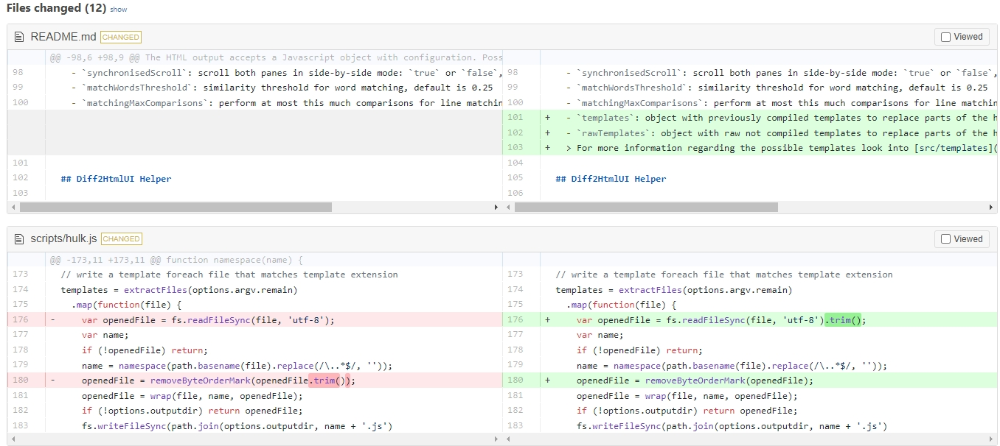

---
date:
  created: 2024-09-19
draft: true
---

# Vue使用jsdiff/diff2html实现新旧数据对比的可视化

## 1. 效果图


## 2. 资料连接
- http://incaseofstairs.com/jsdiff/
- https://github.com/kpdecker/jsdiff
- https://www.npmjs.com/package/diff2html
- [在线Demo](https://diff2html.xyz/demo?matching=none&matchWordsThreshold=0.25&maxLineLengthHighlight=10000&diffStyle=word&colorScheme=light&renderNothingWhenEmpty=0&matchingMaxComparisons=2500&maxLineSizeInBlockForComparison=200&outputFormat=line-by-line&drawFileList=true&synchronisedScroll=1&highlight=1&fileListToggle=1&fileListStartVisible=0&highlightLanguages=%5Bobject%20Map%5D&smartSelection=1&fileContentToggle=1&stickyFileHeaders=1&diff=https://github.com/rtfpessoa/diff2html/pull/106
)
- https://juejin.cn/post/6855129008007774216

## 3. 项目使用
```html
npm install diff --save
npm install diff2html --save
```

## 4. 核心代码
```html
# 接收渲染的容器
<div v-html="prettyHtml" />

<script>
# 引入
import * as Diff from 'diff'
import * as Diff2Html from 'diff2html';
import 'diff2html/bundles/css/diff2html.min.css';

computed: {
    # 获取新旧数据
    prettyHtml() {
      return Diff2Html.html(this.diffs, {
        drawFileList: true,
        matching: 'lines',
        outputFormat: 'side-by-side',
      });
    }
},
methods: {
    # 计算不同的数据
    getNewData (value) {
      this.diffs = Diff.createTwoFilesPatch('历史版本', '当前版本', this.componentKey, value)
    }
}

</script>
```